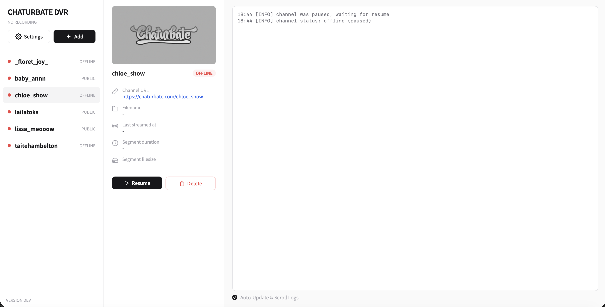
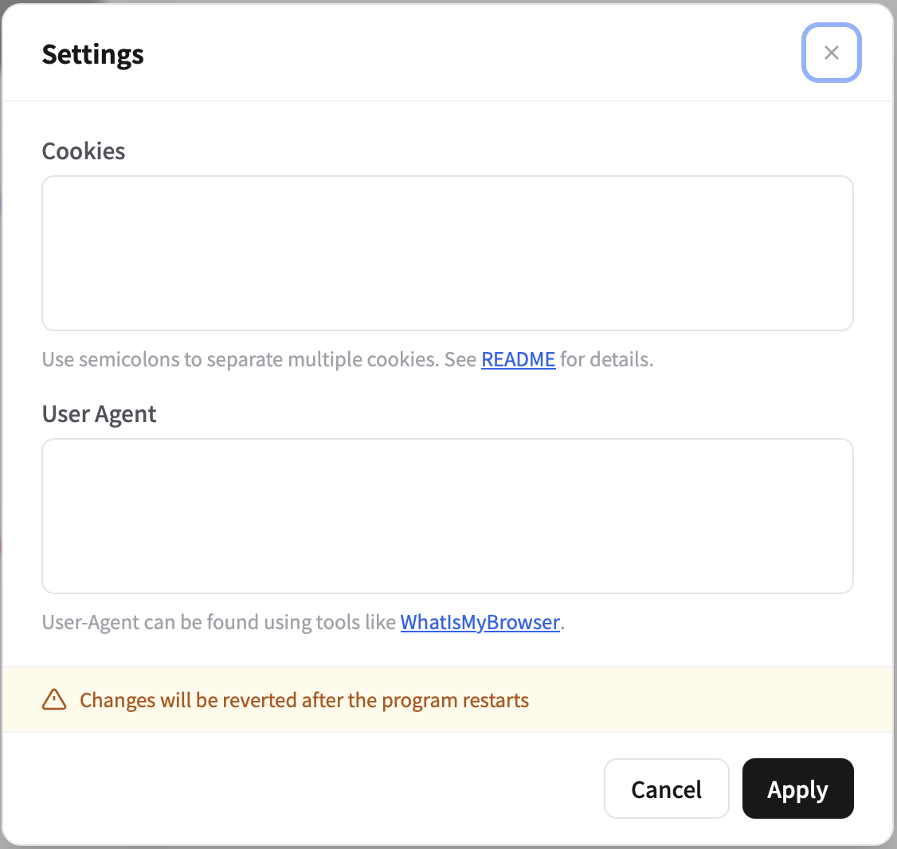

# Chaturbate DVR

一个使用 Go 编写的 Chaturbate 多频道自动录制器，提供中文 Web 管理界面、CLI 和 Docker 部署方式，支持传统 HLS（TS）以及 LL-HLS/fMP4 音视频双轨直播。

本项目只录制当前能够公开访问的直播。私密、群组、隐藏、暂离和离线状态不会录制，也不会绕过 Cloudflare、登录验证或其他访问控制。请仅在获得授权并符合当地法律及平台规则的情况下使用。





## 功能特点

- 同时监控和录制多个频道，支持添加、批量添加、暂停、恢复和删除。
- 中文 Web UI、中文状态和中文运行日志，桌面端与移动端均可使用。
- 添加频道时只需填写用户名；分辨率、帧率、文件名、分段、压缩和音视频容差均由全局设置统一管理。
- 重复添加频道不会跳转到错误页面；批量添加后会提示成功数量以及跳过的重复频道。
- 支持传统 HLS，以及视频、音频分离的 LL-HLS/fMP4。
- 音视频播放列表并行请求、分片有界并发下载，并按媒体时间轴而不是下载完成顺序写入。
- LL-HLS 录制期间持续生成可读取的双轨 fragmented MP4，结束后重新封装为支持快速播放的普通 MP4。
- 识别播放列表 discontinuity、时间戳回退和初始化分片变化，并自动轮转文件。
- 对 403/404、429、5xx、过期播放列表和分片失败采用不同的安全处理策略。
- 支持按时长或大小分段、录制后压缩、完成后移动至输出目录，以及按频道建立子目录。
- 录像、合并、压缩和移动均不会覆盖同名文件；冲突时自动添加 ` (1)`、` (2)` 等后缀。
- 意外退出后自动恢复有效的 `.recording.mp4`，无法恢复的文件会改名为 `.corrupt` 隔离。
- 原子保存频道和全局配置，支持优雅关闭、磁盘预留和录制文件定期 `fsync`。

## 快速开始

### 下载自动构建版本

每次提交进入 `main` 后，GitHub Actions 会先执行前端构建、Go 格式检查、`go vet` 和全量测试，再并行编译多平台二进制。全部任务成功后，会在 [Releases](https://github.com/lonesafe/chaturbate-dvr/releases) 中创建一个带提交号的正式版本，并将其标记为仓库的 Latest Release。

自动构建包含：

- Linux：x86、x86_64、ARMv7、ARM64；
- macOS：x86_64、ARM64；
- Windows：x86、x86_64、ARM64；
- `SHA256SUMS.txt`：全部二进制的 SHA-256 校验值。

请选择与操作系统和 CPU 架构对应的文件。macOS 下载后如没有执行权限，可运行 `chmod +x chaturbate-dvr-macos-*`；Linux 同理。

### Docker Compose

仓库自带的 [`docker-compose.yml`](docker-compose.yml) 会将录像和配置分别保存到当前目录下的 `videos` 与 `conf`：

```bash
docker compose up -d
```

启动后访问：<http://localhost:8080>

查看日志和停止容器：

```bash
docker compose logs -f
docker compose down
```

> `docker-compose.yml` 默认使用 `yamiodymel/chaturbate-dvr` 镜像。若要确保镜像与当前仓库提交完全一致，请按下一节自行构建。

### 从当前源码构建 Docker 镜像

```bash
docker build -t chaturbate-dvr:local .

docker run -d \
  --name chaturbate-dvr \
  --restart unless-stopped \
  -p 8080:8080 \
  -v "$(pwd)/videos:/usr/src/app/videos" \
  -v "$(pwd)/conf:/usr/src/app/conf" \
  chaturbate-dvr:local
```

Docker 镜像已经包含 CA 证书、时区数据和 FFmpeg。

### 本地运行

需要 Go 1.25 或更高版本。强烈建议同时安装 `ffmpeg` 和 `ffprobe`；没有 FFmpeg 时录像仍会保留，但完成后的 MP4 无法进行 fast-start 优化，首次载入可能较慢，压缩功能也不可用。

```bash
go build -o chaturbate-dvr .
./chaturbate-dvr
```

Windows：

```powershell
go build -o chaturbate-dvr.exe .
.\chaturbate-dvr.exe
```

不传 `--username` 时启动 Web UI；传入用户名时进入单频道 CLI 模式，并关闭 Web UI：

```bash
./chaturbate-dvr --username channel_name
```

## Web UI 使用说明

### 添加和批量添加频道

点击“添加”，输入一个或多个频道用户名。批量输入支持：

- 每行一个用户名；
- 英文逗号 `,` 或中文逗号 `，`；
- 英文分号 `;` 或中文分号 `；`。

提交后页面会提示：

- 成功添加了多少个频道；
- 成功添加的频道名称；
- 因已经存在或本次输入重复而跳过的频道。

频道名称会统一转换为小写，只保留字母、数字、下划线和连字符。已添加频道会保存到 `conf/channels.json`，下次启动自动恢复监控状态。

### 全局设置

“设置”中的项目对所有频道生效，新添加频道不再单独保存一套录制参数。

| 设置项 | 说明 |
| --- | --- |
| 录制分辨率 | 支持 240p 至 4K；目标分辨率不可用时选择较低档位。 |
| 帧率 | 30 FPS 或 60 FPS（实际值取决于直播源）。 |
| 文件名格式 | Go Template 格式的相对路径；不能包含 `..`。 |
| 最大文件大小 | 单个文件达到指定 MB 后轮转；`0` 表示禁用。 |
| 最长时长 | 单个文件达到指定分钟数后轮转；`0` 表示禁用。 |
| 压缩为 MKV | 录制结束后使用 FFmpeg 压缩，优先使用可用的硬件编码器，失败时保留原始录像。 |
| 音视频配对容差 | LL-HLS 双轨时间轴允许的偏移，范围 1–5000 ms，默认并建议使用 `1000` ms。 |
| Cookies | 浏览器正常访问站点后获得的 Cookie，多个值使用分号分隔。 |
| User-Agent | 必须尽量与取得 Cookie 时使用的浏览器保持一致。 |

设置保存在 `conf/settings.json`。音视频配对容差从下一次播放列表轮询开始生效，其他录制参数从频道的下一次录制会话开始生效。

> 文件名格式推荐始终使用相对路径。若程序是用绝对录制路径启动的，Web UI 只允许继续使用该已信任的录制根目录，不能切换到其他绝对目录。

## 文件名格式

可用变量：

- `{{.Username}}`
- `{{.Year}}`
- `{{.Month}}`
- `{{.Day}}`
- `{{.Hour}}`
- `{{.Minute}}`
- `{{.Second}}`
- `{{.Sequence}}`

默认格式：

```text
videos/{{.Username}}_{{.Year}}-{{.Month}}-{{.Day}}_{{.Hour}}-{{.Minute}}-{{.Second}}{{if .Sequence}}_{{.Sequence}}{{end}}
```

按频道建立目录：

```text
videos/{{.Username}}/{{.Year}}-{{.Month}}-{{.Day}}_{{.Hour}}-{{.Minute}}-{{.Second}}{{if .Sequence}}_{{.Sequence}}{{end}}
```

格式中不需要填写扩展名。传统 HLS 自动保存为 `.ts`；LL-HLS/fMP4 自动保存为 `.mp4`。

## 录像文件和恢复机制

LL-HLS 双轨直播录制时的文件名为：

```text
example.recording.mp4
```

它是持续增长的 fragmented MP4，录制期间可以读取。录制结束后，程序会通过 FFmpeg 在不重新编码的情况下生成带前置索引的 fast-start MP4：

```text
example.mp4
```

处理过程遵循以下安全规则：

- fast-start 优化、音视频合并、压缩和输出目录移动都先写临时文件，再提交最终文件；
- 最终输出已存在时绝不覆盖，而是选择新的文件名；
- 优化或压缩失败时保留原始文件；
- 只有在新输出已经验证并提交后，才会清理原始或轨道文件；
- 默认至少预留 512 MiB 磁盘空间，低于阈值时安全停止当前录制；
- Web 模式启动时会扫描录制目录，恢复有效的 `.recording.mp4`；结构损坏的文件改名为 `.corrupt`，不会直接删除。

如果正在录制的 MP4 打开较慢，这是 fragmented MP4 的正常特性。请等待直播结束后的 fast-start 收尾完成，或确认运行环境中可以执行 `ffmpeg`。

## Cookies、Cloudflare 与访问权限

本程序不能自动绕过 Cloudflare 验证，也不会破解受限直播。若正常请求被 Cloudflare 拦截，可以使用你本人浏览器会话中的 Cookie：

1. 使用浏览器打开程序配置的 Chaturbate 域名并正常完成验证。
2. 在浏览器开发者工具中复制该域名下需要的 Cookie，例如仍有效的 `cf_clearance`。
3. 复制同一浏览器的 User-Agent。
4. 在 Web UI 的“设置”中同时填写 Cookies 和 User-Agent。

Cookie 会过期，并且可能与 User-Agent、IP 地址或站点域名绑定。反复出现“被 Cloudflare 拦截”时，应重新在浏览器中正常完成验证并更新设置，而不是提高请求频率。

`conf/settings.json` 可能包含敏感 Cookie：

- 不要上传、分享或提交该文件；仓库的 `.gitignore` 已默认排除整个 `conf` 目录。
- Web UI 默认没有身份验证。如果需要从局域网以外访问，请至少设置 `--admin-username` 和 `--admin-password`，并在反向代理上启用 HTTPS。
- 只有两个管理员参数都非空时，HTTP Basic Auth 才会启用。

私密、群组、隐藏、暂离和离线直播会结束当前录制并进入监控等待，不会尝试继续下载。

## 命令行参数

可随时使用 `--help` 查看当前版本支持的参数。

| 参数 | 默认值 | 说明 |
| --- | ---: | --- |
| `--username`, `-u` | 空 | 指定后进入单频道 CLI 模式。 |
| `--port`, `-p` | `8080` | Web UI 监听端口。 |
| `--admin-username` | 空 | Web UI Basic Auth 用户名。 |
| `--admin-password` | 空 | Web UI Basic Auth 密码。 |
| `--framerate` | `30` | 目标帧率。 |
| `--resolution` | `1080` | 目标分辨率。 |
| `--pattern` | `videos/...` | 录像文件名模板，不包含扩展名。 |
| `--max-duration` | `0` | 每段最大分钟数，`0` 禁用。 |
| `--max-filesize` | `0` | 每段最大 MB，`0` 禁用。 |
| `--interval` | `1` | 离线频道检查间隔，单位为分钟。 |
| `--cookies` | 空 | 请求 Cookie，格式为 `key=value; key2=value2`。 |
| `--user-agent` | 空 | 自定义浏览器 User-Agent。 |
| `--domain` | `https://chaturbate.com/` | 请求使用的 Chaturbate 域名。 |
| `--compress` | `false` | 录制结束后压缩为 MKV，需要 FFmpeg。 |
| `--output-dir` | 空 | 将已完成录像移动到此目录；也可使用 `OUTPUT_DIR` 环境变量。 |
| `--per-model-folder` | `false` | 在输出目录内按频道建立子目录；也可使用 `PER_MODEL_FOLDER`。 |
| `--segment-workers` | `6` | 每条轨道的最大并行分片下载数。 |
| `--pending-seconds` | `60` | 未配对音视频时间轴的最大等待秒数。 |
| `--max-pending-mb` | `512` | 每条轨道未配对分片的最大内存量。 |
| `--min-free-disk-mb` | `512` | 必须保留的最小可用磁盘空间。 |
| `--sync-seconds` | `3` | 两次录像文件 `fsync` 的最大间隔秒数。 |
| `--sync-fragments` | `10` | 两次 `fsync` 之间的最大分片数。 |
| `--max-text-mb` | `4` | API 和播放列表文本响应上限。 |
| `--max-segment-mb` | `64` | 初始化分片和媒体分片响应上限。 |
| `--http-timeout-seconds` | `30` | API 和播放列表请求超时。 |
| `--segment-timeout-seconds` | `120` | 媒体分片请求超时。 |

音视频配对容差不是启动参数，只能在 Web UI 的“设置”中管理，默认值为 `1000` ms。

### CLI 示例

```bash
# 单频道录制，720p / 60 FPS
./chaturbate-dvr --username channel_name --resolution 720 --framerate 60

# 每 30 分钟轮转一次文件
./chaturbate-dvr --username channel_name --max-duration 30

# 完成后移动到归档目录，并按频道建立子目录
./chaturbate-dvr --output-dir /downloads --per-model-folder

# 使用 SOCKS5/HTTP 代理（由 Go HTTP 客户端读取环境变量）
HTTPS_PROXY=socks5://127.0.0.1:9050 ./chaturbate-dvr
```

启动参数的显式值优先于 `conf/settings.json` 中对应的全局设置。

## HTTP 与分片错误处理

- 所有非 2xx 响应都会转换为结构化错误，错误页不会写入录像。
- 单个媒体分片返回 403/404 时立即跳过，不重复请求该分片。
- 其他分片错误最多请求三次，仍失败则跳过。
- master、media playlist 或 init 分片返回 403/404 时结束当前会话并重新获取直播地址。
- 整批媒体分片均返回 403 时刷新播放列表会话。
- 429 遵循 `Retry-After`，5xx 使用退避策略。
- API 返回非公开状态时完成当前文件收尾，然后回到频道监控。

## 常见问题

### 保存设置时报“文件名格式不能包含 `..`”

Web UI 中请使用相对路径，例如：

```text
videos/{{.Username}}/{{.Year}}-{{.Month}}-{{.Day}}_{{.Hour}}-{{.Minute}}-{{.Second}}
```

不要使用 `../videos`。只有程序启动时已经配置的绝对录制根目录，才允许在 Web UI 中继续使用。

### 视频首次载入特别慢

先检查文件名和频道日志：

- `.recording.mp4` 表示直播仍在录制，是 fragmented MP4；等待录制结束和收尾处理完成。
- 日志出现“快速播放优化失败”通常表示 FFmpeg 不存在、执行失败或临时磁盘空间不足。
- Dockerfile 构建的镜像已包含 FFmpeg；本地二进制需要自行安装并确保 `ffmpeg` 位于 `PATH`。

### 显示“录制中”但文件长时间不增长

检查日志是否反复出现“双轨 playlist 长时间没有可配对分片”。将 Web 设置中的“音视频配对容差”保持为 `1000` ms；过低的值可能导致有效音视频片段无法配对。若仍反复出现，通常是直播源时间轴异常或播放列表会话已经失效，程序会自动尝试刷新地址。

### 频道不能录制

- 确认用户名正确，且频道当前状态为公开直播。
- 私密、群组、隐藏、暂离或离线状态不会录制。
- 若日志提示 Cloudflare 或年龄验证，请按本文前述方式更新本人浏览器会话的 Cookies 和 User-Agent。
- 检查 NAS/服务器时间、DNS、代理、防火墙和目标域名是否可访问。

### Docker 容器不停重启

```bash
docker logs --tail 200 chaturbate-dvr
docker inspect chaturbate-dvr --format '{{.State.ExitCode}} {{.State.Error}} {{.State.OOMKilled}}'
```

常见原因包括配置目录不可写、录像目录不可写、端口被占用、参数格式错误、磁盘空间不足或容器被 OOM 杀死。不要在未备份 `videos` 和 `conf` 的情况下删除卷或重新创建目录。

### 端口 8080 已被占用

```bash
./chaturbate-dvr --port 8123
```

然后访问 <http://localhost:8123>。

## 开发与验证

修改 Go 代码后至少运行：

```bash
go fmt ./...
go vet ./...
go test ./...
```

涉及并发时建议增加竞态检测：

```bash
go test -race ./channel ./manager ./chaturbate ./internal ./router ./config
```

修改前端 Tailwind 样式后重新生成嵌入的 CSS：

```bash
npm ci
npm run build:css
```

交叉构建示例：

```bash
GOOS=windows GOARCH=amd64 go build ./...
GOOS=linux GOARCH=arm64 go build ./...
```

更多构建命令见 [`README_DEV.md`](README_DEV.md)。Pull Request 会执行相同的验证和多平台编译，但不会发布；每次提交进入 `main` 后才会自动创建正式 Release，并更新仓库首页显示的 Latest 版本。

## 项目来源与许可

本仓库基于 [teacat/chaturbate-dvr](https://github.com/teacat/chaturbate-dvr) 深度修改，保留原项目的 MIT License。详情见 [`LICENSE`](LICENSE)。

Chaturbate 名称及相关商标归其权利人所有，本项目与 Chaturbate 官方无隶属或授权关系。
